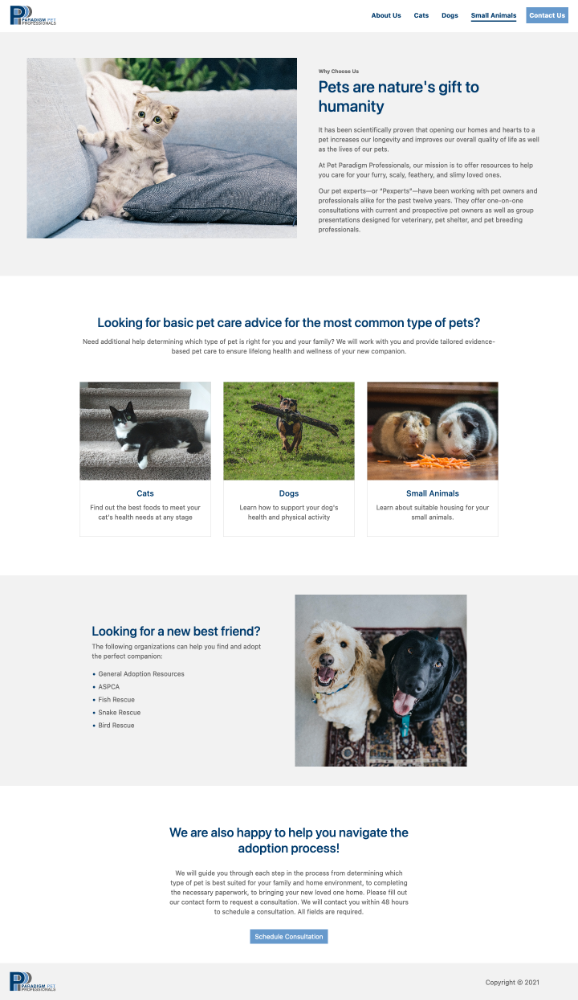

# Paradigm Pet Professionals

Paradigm Pet Professionals is a website created for a UI challenge involving a fictional pet care consultation agency. 

## Table of contents

- [Overview](#overview)

  - [The challenge](#the-challenge)
  - [Screenshot](#screenshot)
  - [Links](#links)

- [My process](#my-process)

  - [Built with](#built-with)

- [Author](#author)

## Overview

### The challenge

Users should be able to:

- View the optimal layout for the site depending on their device's screen size
- Submit their information for a consultation

### Screenshot

<kbd></kbd>

### Links

- Source URL: [https://github.com/dinahbrito/PPP](https://github.com/dinahbrito/PPP)
- Live Site URL: [https://paradigm-pet-professionals.netlify.app/](https://paradigm-pet-professionals.netlify.app/)

## My process

### Built with

- Semantic HTML5 markup
- CSS 
- Bootstrap

## Author

- Website - [Dinah Brito](https://www.dinahbrito.com)
- LinkedIn - [dinahbrito](https://www.linkedin.com/in/dinahbrito/)

